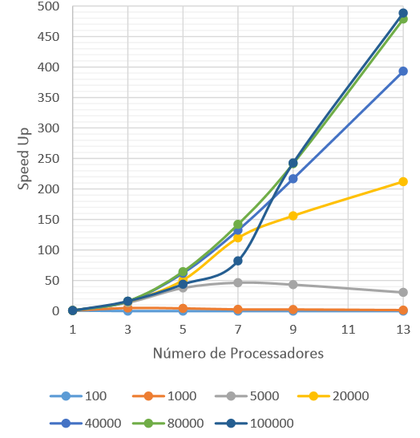

# SortingEfficiencyAnalysis
This repository presents the comparison of many parallel sorting algorithms and its execution times for n different CPU numbers.

Each folder of the repository contains a different sorting algorithm working in coordination with differnt parallel paradigms. 

- **Rank Sort** - Master and slave paradigm.
- **Insertion Sort** - Pipeline paradigm.
- **Merge Sort** - Used in both Divide and Conquer paradigm, and the parallel Parallel Phases.
- **Odd-even** - Parallel Phases paradigm.

All folders contain a PDF report, in portuguese, describing its performances and efficiencies when varying the number of input elements and the number of CPUs. The efficiency plots for each algorithm is also found above. The Y-axis represents the efficiency, the X-axis represents the number of processors, and each line represents different input array sizes.

## Rank Sort

## Insertion Sort

## Merge Sort - Divide and Conquer

## Merge Sort - Parallel Phases

## Odd Even

Any questions, feel free to contact me via <a href=mailto:marcelomlinck@gmail.com>e-mail</a>.
